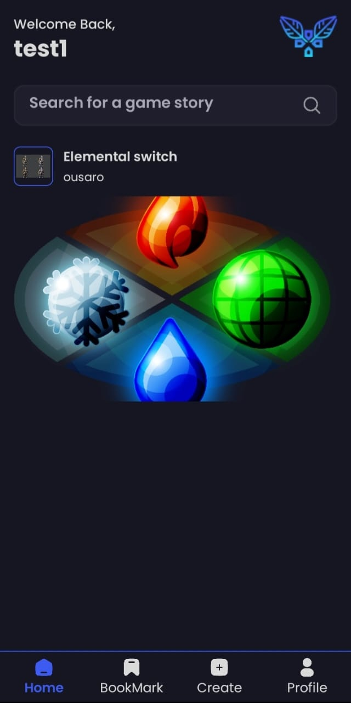

# GameStoryCreator

**GameStoryCreator** is a mobile application built with React Native, Expo, NativeWind, TypeScript, and Supabase. This app allows users to post their game stories, including sections for the story itself, character lists with descriptions, and areas with descriptions. Users can also search for specific posts or save the ones they like.

## Table of Contents

- Features
- App Preview
- Prerequisites
- Installation
- Connect To Supabase
- Migrations
- Usage
- Project Structure
- Building with EAS CLI
- Contributing
- License

## Features

- Post game stories with a detailed story section.
- Add character lists with descriptions for each character.
- Add area descriptions related to the story.
- Search for specific posts using search bar.
- Save posts to revisit later.

## App Preview

To give users a better idea of what your app looks like, here are some preview images of **GameStoryCreator**:

### GetStarted Screen


### Authentiction Screen
<div>
  
  
</div>

### Main Screens
<div>
  
  
  
  
</div>

### Search Screen
 

### Post Detail Screen
<div>
  
  
</div>

### Story/Character Detail Screen
When you click on the story or the character.
<div>
  
  
</div>

### Video Showing tha app working
[Preview Video (./assets/screenshots/GetStarted.jpg)](https://youtube.com/shorts/K2OQFeWnF5s?feature=share)


## Prerequisites

Before you begin, ensure you have met the following requirements:

- **Node.js**: Ensure you have Node.js installed (v14 or above recommended).
- **Expo CLI**: Install Expo CLI globally.
- **EAS CLI**: Install EAS CLI globally.
- **Supabase**: Create a Supabase account and set up a project.
- **TypeScript**: Knowledge of TypeScript is recommended.

## Installation

1. **Clone the repository:**

   ```bash
   git clone https://github.com/ousaro/GameStoryCreator.git
   cd GameStoryCreator
   ```

2. **Install dependencies:**

   ```bash
   npm install
   ```

3. **Set up environment variables:**

   Create a `.env` file in the root directory and add your Supabase credentials:

   ```bash
   EXPO_PUBLIC_SUPABASE_URL=your-supabase-url
   EXPO_PUBLIC_SUPABASE_ANON_KEY=your-supabase-anon-key
   ```

## Connect to Supabase

Before running migrations, you need to connect to your Supabase project via the command line in Visual Studio Code. Use the following command to log in to your Supabase account:

```bash
supabase login
```

After logging in, ensure you're connected to the correct project by running:

```bash
supabase link --project-ref your-project-ref
```

Replace `your-project-ref` with your actual Supabase project reference. Once connected, you can proceed with the migrations.


## Migrations

Before starting the project, you need to run the following migrations in order to set up the database correctly:

1. **Verify the migrations exist:**

   - `20240814164106_StoryGameCreator`: for profiles table and avatars storage and linking the auth table in supabase with this profiles table.
   - `20240816161249_update_stories_table_owner`: creation of  stories table to include an owner field and a story_images storage.
   - `20240818174425_add_favoriteTable`: Add a table to manage favorite posts.

2. **Run the migrations:**

   ```bash
   supabase db push 20240814164106_StoryGameCreator
   supabase db push 20240816161249_update_stories_table_owner
   supabase db push 20240818174425_add_favoriteTable
   ```

Ensure you run these migrations in the specified order for the database setup to work correctly.

## Usage

1. **Start the development server:**

   ```bash
   expo start -c
   ```

2. **Open the app:**

   Use Expo Go on your device or an emulator to scan the QR code generated by Expo.

3. **Post a Game Story:**

   - Navigate to the "Create" section.
   - Fill in the story details.
   - Post you story.
   - After adding the post click on it and add characters with descriptions and image, and describe the areas and add an image for it.
   - Save your story.

4. **Search and Save Posts:**

   - Use the search feature to find specific posts by keywords.
   - Save the posts you like for easy access later.

5. **Edit post:**
   -The app allow you also to edit you post story and characters and areas description.
## Project Structure

The project is structured as follows:

```bash
GameStoryCreator/
│
├── app/                # The main folder in the app contain the navigation stucture and the code for each screen
├── assets/             # Asset files (images, fonts,icons, etc.)
├── components/         # Reusable UI components
├── constants/          # All the constants use in the app like (image, color , icons , etc.)
├── contexts/           # Context API for global state management
├── hooks/              # Custom hooks
├── lib/                # Contain the connection with supabase and the api logic functions
├── supabase/           # This contain all the migrations file and logic
├── types/              # TypeScript types and interfaces
└── .env                # Environment variables
```


## Building with EAS CLI

1. **Log in to Expo:**

   Before you can use the EAS CLI, you need to log in to your Expo account. Use the following command to log in:

   ```bash
   eas login
   ```

   Enter your Expo account credentials when prompted.

2. **Upload the `.env` file:**

  Before building the app, you need to upload your .env file to Expo using the following command:

   ```bash
    eas secret:create --name ENV_FILE --value "$(cat .env)" --scope project
   ```

   This command uploads the content of your .env file as a secret named ENV_FILE that will be accessible during the build process.

3. **Build the app:**

   - For Android:

     ```bash
     eas build --platform android
     ```

   - For iOS:

     ```bash
     eas build --platform ios
     ```

   This command triggers the build process for the specified platform. Expo will use the secrets you uploaded during the build.

4. **Deploy the app:**

   After building, follow these steps to publish your app:

   - For Android: Follow the prompts or instructions provided by Expo to publish your app to the Google Play Store.

   - For iOS: Follow the prompts or instructions provided by Expo to publish your app to the App Store.


## Contributing

Contributions are welcome! Please fork the repository and use a feature branch. Pull requests are accepted.

## License

This project is licensed under the MIT License - see the LICENSE file for details.

If you modify this code and redistribute it, please ensure that:

- The modified code is also distributed under the MIT License.
- The original copyright notice and this license text are included in all copies or substantial portions of the modified code.


